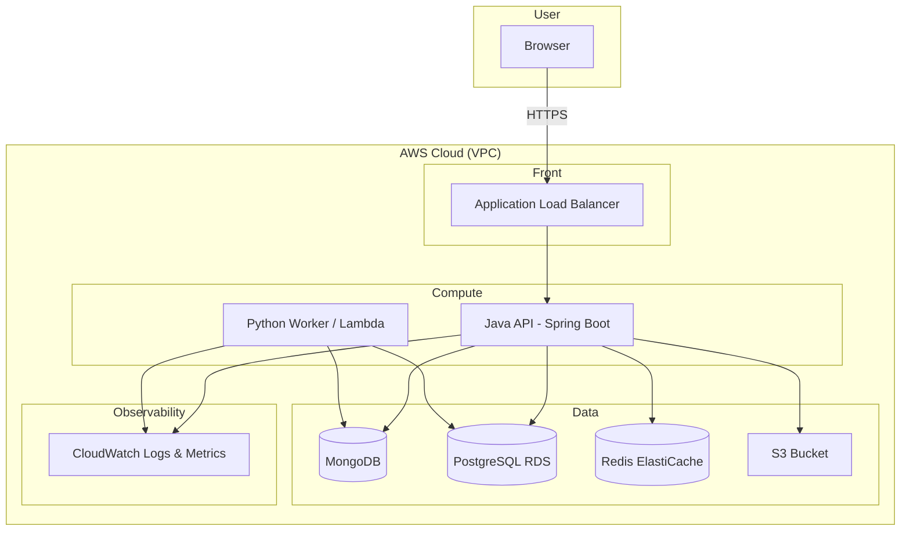

# Full-Stack SDLC Exercise: Financial Domain Project Blueprint for Students

**Document Version:** 1.0  
**Purpose:** End-to-end learning of SDLC, full-stack fundamentals, and cloud deployment with Java (Spring Boot), React, Python, SQL, NoSQL, and cache.

---

## Table of Contents

1. [Executive Summary](#1-executive-summary)
2. [Learning Objectives](#2-learning-objectives)
3. [Project Overview](#3-project-overview)
4. [Tech Stack & Tools](#4-tech-stack--tools)
5. [Requirements Specification](#5-requirements-specification)
6. [Architecture Design & AWS Diagram](#6-architecture-design--aws-diagram)
7. [Low-Level Design: API](#7-low-level-design-api)
8. [Low-Level Design: Frontend](#8-low-level-design-frontend)
9. [Low-Level Design: Database](#9-low-level-design-database)
10. [Step-by-Step SDLC Guide](#10-step-by-step-sdlc-guide)
11. [Logging, Monitoring & CloudWatch](#11-logging-monitoring--cloudwatch)
12. [Timeline & Checklist](#12-timeline--checklist)
13. [Appendix: Free Tier & Tools](#13-appendix-free-tier--tools)

---

## 1. Executive Summary

This exercise is a single, end-to-end project that takes a student through the **full Software Development Life Cycle (SDLC)** while exposing them to:

- **Networking:** HTTP/HTTPS, REST, API design, load balancing, DNS
- **Application layer:** Java (Spring Boot), React, Python services
- **Security layer:** Auth (JWT), HTTPS, IAM, secrets, input validation
- **Database layer:** MongoDB (NoSQL), PostgreSQL (SQL), Redis (cache)
- **Frontend:** React with modern tooling and responsive UI
- **Cloud:** AWS (EC2/ECS, RDS, ElastiCache, S3, CloudWatch, etc.)
- **DevOps:** CI/CD, logging, monitoring, alerts

**Suggested project:** **"FinanceTrack"** — A personal finance and budgeting platform with accounts, transactions, receipt attachments, spending analytics, and scheduled reports. It naturally uses all layers and technologies above.

---

## 2. Learning Objectives

| Area | What the Student Will Learn |
|------|-----------------------------|
| **SDLC** | Requirements → Design → Implementation → Testing → Deployment → Monitoring |
| **Networking** | REST APIs, status codes, headers, CORS, API versioning |
| **Application** | Spring Boot routing, filters, React state management, Python scripts/services |
| **Security** | JWT auth, password hashing, HTTPS, input sanitization, principle of least privilege |
| **Database** | Schema design (SQL vs NoSQL), indexing, migrations, connection pooling, caching strategies |
| **Frontend** | Component architecture, API integration, responsive design, accessibility basics |
| **Cloud** | VPC, compute, managed DBs, object storage, monitoring, cost awareness |

---

## 3. Project Overview

### 3.1 Project Name: FinanceTrack

**One-line description:** A web-based personal finance and budgeting application with accounts, transactions, receipt storage, spending analytics, and scheduled reports, built with Java (Spring Boot), React, Python, SQL, NoSQL, and Redis, deployed on AWS.

### 3.2 Core Features (MVP)

- **User management:** Registration, login, JWT-based auth, profile
- **Accounts & transactions:** CRUD for financial accounts (e.g., checking, savings, cash) and transactions; categories; type (income, expense, transfer)
- **Receipt/statement attachments:** Upload transaction receipts or statements (stored in S3)
- **Spending overview:** Optional polling or WebSocket for balance/transaction updates (can start with polling)
- **Analytics dashboard:** Aggregated stats (e.g., spending by category, income vs expense, account balances) — good use case for **PostgreSQL** for reporting
- **Background jobs:** Python service for scheduled report generation or data sync — demonstrates **Python** in the stack
- **Caching:** Redis for session cache and frequently accessed account/transaction lists

### 3.3 Out of Scope (for MVP)

- Real bank integrations (manual entry only)
- Advanced RBAC (keep to simple roles: Admin, Member)
- Mobile native apps (web-only for the exercise)

---

## 4. Tech Stack & Tools

### 4.1 Summary Table

| Layer | Technology | Role | Free Tier / Trial |
|-------|------------|------|--------------------|
| **Frontend** | React 18+ | SPA | Free |
| **API** | Java 17+ (Spring Boot) | REST API | Free |
| **NoSQL DB** | MongoDB (Atlas or self-hosted) | Main app data (users, accounts, transactions) | Atlas free tier |
| **SQL DB** | PostgreSQL (e.g., RDS / local) | Analytics, reporting tables | AWS RDS free tier / local |
| **Cache** | Redis (e.g., ElastiCache / local) | Sessions, hot data | ElastiCache free tier (750 hrs/mo) or local |
| **Object storage** | AWS S3 | Receipt/statement attachments | S3 free tier (5 GB) |
| **Python service** | Python 3.x + FastAPI/Flask | Background jobs, reports | Free |
| **Cloud** | AWS | Compute, DB, cache, storage, monitoring | Free tier 12 months |
| **Logging & monitoring** | AWS CloudWatch | Logs, metrics, dashboards, alarms | Free tier (5 GB logs, basic metrics) |
| **CI/CD** | GitHub Actions | Build, test, deploy | Free for public repos |
| **Version control** | Git + GitHub | Source control | Free |
| **API testing** | Postman / Insomnia | Manual and collection tests | Free |
| **Diagrams** | Draw.io / Mermaid | Architecture and LLD | Free |

### 4.2 Why This Stack

- **Java (Spring Boot):** Industry-standard enterprise backend; strong typing, ecosystem, and deployment options.
- **Python:** Separate service for jobs/reports; teaches polyglot backend and scripting.
- **MongoDB:** Flexible schema for accounts/transactions; good for rapid iteration.
- **PostgreSQL:** Strong for analytics and reporting (aggregations, JOINs).
- **Redis:** Introduces caching and session storage concepts.
- **AWS:** Industry-standard cloud; free tier supports this entire exercise.

---

## 5. Requirements Specification

### 5.1 Functional Requirements

| ID | Requirement | Priority |
|----|-------------|----------|
| FR-1 | User can register with email and password | Must |
| FR-2 | User can log in and receive a JWT | Must |
| FR-3 | User can create, read, update, delete financial accounts | Must |
| FR-4 | User can create, read, update, delete transactions under an account | Must |
| FR-5 | User can assign a category to a transaction (e.g., Food, Transport) | Must |
| FR-6 | User can upload one or more receipts/files per transaction (stored in S3) | Must |
| FR-7 | User can view a dashboard with spending summary, by category, and account balances | Must |
| FR-8 | System runs a daily Python job (e.g., report generation or sync) | Should |
| FR-9 | Frequently accessed account/transaction lists are cached in Redis | Should |

### 5.2 Non-Functional Requirements

| ID | Requirement | Target |
|----|-------------|--------|
| NFR-1 | API response time (p95) | < 500 ms for read APIs |
| NFR-2 | Frontend first contentful paint | < 2 s |
| NFR-3 | All APIs over HTTPS | Enforced |
| NFR-4 | Sensitive data (passwords) not logged | Enforced |
| NFR-5 | Logs and metrics in CloudWatch | All environments |

### 5.3 User Roles

- **Admin:** Full access; can manage users and system settings.
- **Member:** Can manage own accounts and transactions only.

---

## 6. Architecture Design & AWS Diagram

### 6.1 High-Level Architecture

```
                                    ┌─────────────────────────────────────────────────────────────┐
                                    │                        AWS Cloud (VPC)                      │
                                    │                                                             │
  ┌──────────┐                      │   ┌─────────────┐     ┌─────────────┐     ┌─────────────┐   │
  │  User    │   HTTPS              │   │   ALB       │────▶│  Java API   │────▶│  MongoDB    │   │
  │  Browser │─────────────────────▶│   │ (Optional)  │     │ (Spring     │     │  (Atlas or  │   │
  └──────────┘                      │   └─────────────┘     │  Boot)      │     │   EC2/ECS)  │   │
                                    │          │            └──────┬──────┘     └─────────────┘   │
                                    │          │                   │                              │
                                    │          │                   ├────────────▶ ┌─────────────┐ │
                                    │          │                   │              │ PostgreSQL  │ │
                                    │          │                   │              │ (RDS)       │ │
                                    │          │                   │              └─────────────┘ │
                                    │          │                   │                              │
                                    │          │                   ├────────────▶ ┌─────────────┐ │
                                    │          │                   │              │ Redis       │ │
                                    │          │                   │              │(ElastiCache)│ │
                                    │          │                   │              └─────────────┘ │
                                    │          │                   │                              │
                                    │          │                   └────────────▶ ┌─────────────┐ │
                                    │          │                                 │ S3 (files)  │ │
                                    │          │                                 └─────────────┘ │
                                    │          │                                                   │
                                    │          │                   ┌─────────────┐                  │
                                    │          └──────────────────▶│  Python     │ (scheduled job) │
                                    │                              │  Service    │                  │
                                    │                              └──────┬──────┘                  │
                                    │                                     │                         │
                                    │                                     └────────▶ RDS / MongoDB │
                                    │                                                             │
                                    │   ┌─────────────────────────────────────────────────────┐   │
                                    │   │              CloudWatch (Logs, Metrics, Alarms)      │   │
                                    │   └─────────────────────────────────────────────────────┘   │
                                    └─────────────────────────────────────────────────────────────┘
```

### 6.2 AWS Resource Map

| Component | AWS Service | Purpose |
|-----------|-------------|---------|
| Compute (API) | EC2 or ECS Fargate | Run Java (Spring Boot) API server |
| Compute (Python) | EC2, Lambda, or ECS | Run Python job (cron or EventBridge) |
| Load balancing | ALB (optional for single instance) | Distribute traffic, HTTPS termination |
| NoSQL | MongoDB Atlas (or EC2 + MongoDB) | Primary application data |
| SQL | RDS PostgreSQL | Analytics/reporting database |
| Cache | ElastiCache for Redis | Session and query cache |
| Storage | S3 | Receipt/statement attachment files |
| DNS | Route 53 (optional) | Custom domain |
| Logs & metrics | CloudWatch Logs, Metrics, Dashboards | Observability |
| Alerts | CloudWatch Alarms + SNS | Notifications |
| Secrets | Secrets Manager or SSM Parameter Store | DB passwords, JWT secret |
| Networking | VPC, subnets (public/private), security groups | Isolation and security |

### 6.3 Suggested VPC Layout (Conceptual)

- **Public subnets:** ALB (if used), NAT Gateway (for private subnet outbound).
- **Private subnets:** EC2/ECS (API), Python worker; no direct internet.
- **Security groups:**  
  - ALB: Allow 443 from 0.0.0.0/0.  
  - API: Allow traffic only from ALB (or 22 from bastion for SSH).  
  - RDS/ElastiCache: Allow only from API security group.  
  - No direct exposure of DB or Redis to internet.

### 6.4 Mermaid Architecture Diagram (for rendering)



### 6.5 Data Flow Summary

1. User → HTTPS → ALB → Java API.
2. Java API → MongoDB (users, accounts, transactions); → PostgreSQL (analytics); → Redis (cache); → S3 (presigned URLs or server-side upload).
3. Python job triggered by EventBridge (or cron on EC2) → reads/writes RDS or MongoDB → can write reports to S3.
4. All app and access logs → CloudWatch Logs; metrics → CloudWatch Metrics; alarms → SNS (email).

---

## 7. Low-Level Design: API

### 7.1 API Stack

- **Runtime:** Java 17+ (LTS)  
- **Framework:** Spring Boot 3.x  
- **Auth:** JWT (access token in header; optional refresh token).  
- **Validation:** Bean Validation (javax.validation / jakarta.validation).  
- **DB drivers:** Spring Data MongoDB, Spring Data JPA (PostgreSQL), Spring Data Redis (Lettuce).  
- **File upload:** MultipartFile + AWS SDK (S3).

### 7.2 API Base URL and Versioning

- Base: `https://api.<your-domain>/v1`  
- Version in path: `/v1/...` for future compatibility.

### 7.3 Authentication

- **POST /v1/auth/register** — Body: `{ "email", "password", "name" }`. Response: 201 + user (no password).
- **POST /v1/auth/login** — Body: `{ "email", "password" }`. Response: 200 + `{ "accessToken", "expiresIn", "user" }`.
- **GET /v1/auth/me** — Header: `Authorization: Bearer <token>`. Response: 200 + current user.

All protected routes use a filter or interceptor that verifies JWT and attaches the current user (id, email, role) to the security context.

### 7.4 Accounts

| Method | Endpoint | Description | Auth |
|--------|----------|-------------|------|
| GET | /v1/accounts | List accounts (with optional Redis cache key: `accounts:userId:{id}`) | Yes |
| POST | /v1/accounts | Create account; body: `{ "name", "type?", "currency?", "initialBalance?" }` | Yes |
| GET | /v1/accounts/:id | Get one account; cache key: `account:{id}` | Yes |
| PUT | /v1/accounts/:id | Update account | Yes |
| DELETE | /v1/accounts/:id | Delete account (cascade transactions in app logic) | Yes |

### 7.5 Transactions

| Method | Endpoint | Description | Auth |
|--------|----------|-------------|------|
| GET | /v1/accounts/:accountId/transactions | List transactions; cache: `transactions:account:{accountId}` | Yes |
| POST | /v1/accounts/:accountId/transactions | Create transaction; body: `{ "amount", "type", "categoryId?", "description?", "date?" }` | Yes |
| GET | /v1/accounts/:accountId/transactions/:transactionId | Get one transaction | Yes |
| PUT | /v1/accounts/:accountId/transactions/:transactionId | Update transaction | Yes |
| DELETE | /v1/accounts/:accountId/transactions/:transactionId | Delete transaction | Yes |

### 7.6 File Attachments (Receipts / Statements)

| Method | Endpoint | Description | Auth |
|--------|----------|-------------|------|
| POST | /v1/accounts/:accountId/transactions/:transactionId/attachments | multipart/form-data; upload file to S3; save metadata in MongoDB (transaction.attachments[]) | Yes |
| GET | /v1/accounts/:accountId/transactions/:transactionId/attachments/:attachmentId/url | Return presigned S3 URL for download | Yes |
| DELETE | /v1/accounts/:accountId/transactions/:transactionId/attachments/:attachmentId | Remove from S3 and MongoDB | Yes |

### 7.7 Dashboard / Analytics (PostgreSQL)

| Method | Endpoint | Description | Auth |
|--------|----------|-------------|------|
| GET | /v1/dashboard/summary | Aggregates: total accounts, total balance, spending by category, income vs expense. Source: PostgreSQL (synced or written by API from MongoDB). | Yes |

Design choice: Either API writes to PostgreSQL on account/transaction mutations, or a sync job (e.g., Python) periodically aggregates from MongoDB into PostgreSQL. For LLD, “API writes to PostgreSQL on write” is simpler.

### 7.8 Error Responses and Status Codes

- 400: Validation error; body: `{ "message", "errors": [] }`.
- 401: Missing or invalid token.
- 403: Forbidden (e.g., not account owner).
- 404: Resource not found.
- 500: Server error; no stack trace in response; log full error in CloudWatch.

### 7.9 Filter / Interceptor Order

1. Request ID (for tracing).  
2. Body parser (JSON).  
3. CORS.  
4. Rate limiting (optional; can use Redis store later).  
5. Auth (only on protected routes).  
6. Controller handlers.  
7. Global exception handler (@ControllerAdvice): log + standardized JSON error.

---

## 8. Low-Level Design: Frontend

### 8.1 Stack

- **React** 18+ with functional components and hooks.  
- **Build:** Vite.  
- **Routing:** React Router v6.  
- **State:** React Context (auth) + optional React Query (TanStack Query) for server state (accounts, transactions).  
- **HTTP client:** Axios or fetch; base URL from env (e.g., `VITE_API_URL`).  
- **UI:** Tailwind CSS or Material-UI (both have free usage).  
- **Forms:** Controlled components; validation with zod or react-hook-form.

### 8.2 Pages and Routes

| Route | Page | Description |
|-------|------|-------------|
| / | Landing / redirect | Redirect to /login or /app |
| /login | Login | Email + password; on success store token, redirect to /app |
| /register | Register | Email, password, name; then redirect to /login or /app |
| /app | App layout | Sidebar + outlet |
| /app/dashboard | Dashboard | Summary cards and charts (from /v1/dashboard/summary) |
| /app/accounts | Account list | List accounts; link to /app/accounts/:id |
| /app/accounts/:id | Account detail | Account name, balance; list of transactions; “Add transaction” |
| /app/accounts/:id/transactions/:transactionId | Transaction detail | Transaction fields; receipt attachments; edit/delete |

### 8.3 Auth Flow

- On load: if token in localStorage/sessionStorage, call GET /v1/auth/me; if 401, clear token and redirect to /login.
- Login/Register: call API; on success save token and user; redirect to /app.
- Axios interceptor: add `Authorization: Bearer <token>` to every request; on 401 response, clear token and redirect to /login.

### 8.4 Key Components (Conceptual)

- **Layout:** AppLayout (sidebar + header + `<Outlet />`).  
- **Auth:** AuthContext (user, login, logout, isLoading).  
- **Accounts:** AccountList, AccountCard, AccountForm (create/edit).  
- **Transactions:** TransactionList, TransactionCard, TransactionForm, TransactionDetail.  
- **Attachments:** AttachmentList, FileUpload (multipart), download via presigned URL.  
- **Dashboard:** SummaryCard, simple chart (e.g., spending by category — use Chart.js or Recharts, free).

### 8.5 Environment

- `.env.example`: `VITE_API_URL=https://api.example.com/v1`.  
- Production: set `VITE_API_URL` in CI or hosting (e.g., S3 + CloudFront or Vercel).

---

## 9. Low-Level Design: Database

### 9.1 MongoDB (NoSQL) — Primary Store

**Collections:**

- **users**  
  - `_id`, `email` (unique), `passwordHash`, `name`, `role` (admin | member), `createdAt`, `updatedAt`.

- **accounts**  
  - `_id`, `name`, `type` (checking | savings | cash | other), `currency`, `balance`, `ownerId` (ref users), `createdAt`, `updatedAt`.

- **transactions**  
  - `_id`, `accountId`, `amount`, `type` (income | expense | transfer), `categoryId` (ref categories), `description`, `date`, `attachments[]` { `id`, `filename`, `s3Key`, `uploadedAt` }, `createdAt`, `updatedAt`.

- **categories** (optional embedded or separate collection)  
  - `_id`, `name`, `type` (income | expense), `userId` (optional for user-defined), `createdAt`.

Indexes:

- users: `email` unique.  
- accounts: `ownerId`.  
- transactions: `accountId`, `date`, `categoryId`, `accountId + date`.

### 9.2 PostgreSQL (SQL) — Analytics / Reporting

**Tables:**

- **account_stats**  
  - `id` (serial), `account_id` (UUID or string), `account_name`, `user_id`, `total_balance`, `total_income`, `total_expense`, `updated_at`.  
  - Updated by API on account/transaction change or by Python sync job.

- **spending_by_category** (optional)  
  - `id`, `user_id`, `category_name`, `amount`, `period` (e.g., month), `created_at`.  
  - For dashboard charts.

Use PostgreSQL for dashboard “summary” query: SUM total_balance, SUM total_income, SUM total_expense, etc.

### 9.3 Redis — Cache

- **Key patterns:**  
  - `accounts:userId:{userId}` — list of accounts (JSON), TTL e.g. 5 min.  
  - `account:{accountId}` — single account, TTL 5 min.  
  - `transactions:account:{accountId}` — list of transactions, TTL 2 min.  
- **Invalidation:** On create/update/delete of account or transaction, delete the corresponding cache keys.  
- **Optional:** Session store for JWT blacklist or rate limiting.

### 9.4 S3 — File Storage

- **Bucket:** e.g. `financetrack-attachments-<account-id>`.  
- **Key structure:** `attachments/{accountId}/{transactionId}/{uuid}_{originalFilename}`.  
- **Presigned URLs:** GET for download (expiry 5–15 min); upload can be presigned or server-side (MultipartFile → S3).  
- **Security:** Bucket not public; access only via presigned URLs or IAM role from API.

---

## 10. Step-by-Step SDLC Guide

### Phase 1: Planning & Requirements (Week 1)

1. **Kickoff**  
   - Read this document end-to-end.  
   - Set up GitHub repo (e.g. monorepo: `frontend/`, `api/` (Java), `python-worker/`, `docs/`).  
   - Create a simple project board (GitHub Projects or Trello): Backlog, To Do, In Progress, Done.

2. **Requirements**  
   - Copy FR/NFR into issues or a requirements doc in the repo.  
   - Optional: write 2–3 user stories per feature (e.g. “As a user, I can add an account so that…”).

3. **Tools**  
   - Install JDK 17+, Maven or Gradle, Python, Git, Postman/Insomnia, MongoDB Compass (optional).  
   - Sign up: GitHub, AWS (free tier), MongoDB Atlas.  
   - Optional: Draw.io or Mermaid for diagrams.

---

### Phase 2: Design (Week 1–2)

1. **Architecture**  
   - Draw the high-level diagram (as in Section 6) in Draw.io or Mermaid.  
   - List all AWS resources you will use (EC2, RDS, ElastiCache, S3, CloudWatch).  
   - Document in `docs/architecture.md`.

2. **API design**  
   - Finalize OpenAPI (Swagger) or Postman collection: all endpoints, request/response samples, status codes.  
   - Save in repo (e.g. `docs/api.yaml` or Postman export).

3. **Database design**  
   - Finalize MongoDB collections and indexes (as in Section 9.1).  
   - Finalize PostgreSQL tables (Section 9.2).  
   - Document in `docs/database.md`.

4. **Frontend wireframes**  
   - Low-fidelity sketches for: Login, Register, Dashboard, Account list, Account detail, Transaction detail.  
   - Optional: Figma free tier.

---

### Phase 3: Development — Backend API (Weeks 2–4)

1. **Scaffold**  
   - Create Spring Boot project (e.g. start.spring.io): Web, Data MongoDB, Data JPA, Data Redis, Validation, AWS SDK (S3).  
   - Folder structure: `controller/`, `service/`, `repository/`, `config/`, `security/`, `model/` (or `entity/`), `dto/`, `exception/`.

2. **Auth**  
   - Implement POST /auth/register (hash password with BCrypt), POST /auth/login (compare, sign JWT), GET /auth/me.  
   - JWT filter or interceptor: verify token, set SecurityContext.

3. **Accounts CRUD**  
   - Implement all account routes; use MongoDB.  
   - Add Redis caching on GET list and GET by id; invalidate on create/update/delete.

4. **Transactions CRUD**  
   - Same pattern; validate accountId and that user is owner.  
   - Cache transaction list per account; invalidate on change.

5. **Attachments**  
   - MultipartFile for upload; stream to S3; store metadata in transaction.attachments.  
   - Presigned URL endpoint for download; DELETE to remove from S3 and MongoDB.

6. **Dashboard**  
   - Implement GET /dashboard/summary.  
   - On each account/transaction write, update PostgreSQL account_stats (or run a short sync function).  
   - Return aggregated data from PostgreSQL.

7. **Logging**  
   - Use SLF4J/Logback; log every request (requestId, method, path, statusCode, duration).  
   - Do not log passwords or tokens.  
   - Later: ship logs to CloudWatch (see Section 11).

8. **Tests**  
   - Unit tests for auth (hash, JWT), validation.  
   - Integration tests for at least: register, login, create account, create transaction (use @DataMongoTest, test containers, or test DB).

---

### Phase 4: Development — Python Service (Week 4)

1. **Scaffold**  
   - Python 3.10+; FastAPI or Flask; or plain script.  
   - Dependencies: pymongo or motor, psycopg2, boto3 (for S3 if reports are stored), redis.

2. **Job**  
   - Example: “Daily summary” — aggregate from MongoDB (or read from PostgreSQL), generate a simple report (e.g. JSON or CSV), upload to S3 or store in RDS.  
   - Or: cleanup old temporary files in S3; or sync MongoDB → PostgreSQL for analytics.

3. **Trigger**  
   - Local: run via cron or manual.  
   - AWS: EventBridge rule (schedule) → Lambda (Python) or EC2 cron.  
   - Document how to run locally and in AWS.

---

### Phase 5: Development — Frontend (Weeks 4–6)

1. **Scaffold**  
   - `npm create vite@latest frontend -- --template react`; add React Router, Axios, Tailwind or MUI, React Query.

2. **Auth**  
   - Login and Register pages; AuthContext; axios interceptor; protected route wrapper.

3. **Accounts**  
   - List, create, edit, delete; call API; invalidate cache (e.g. React Query) on mutation.

4. **Transactions**  
   - Same for transactions under an account; transaction detail page with attachments.

5. **Dashboard**  
   - Fetch /v1/dashboard/summary; display cards and a simple chart.

6. **Polish**  
   - Loading states, error messages, basic accessibility (labels, focus).

---

### Phase 6: AWS Setup & Deployment (Weeks 5–7)

1. **VPC**  
   - Create VPC; public and private subnets; Internet Gateway; NAT Gateway (if private instances need internet).  
   - Security groups as in Section 6.3.

2. **MongoDB**  
   - Use Atlas free tier (or install on EC2); note connection string; store in Secrets Manager or env.

3. **RDS PostgreSQL**  
   - Create RDS instance (free tier); run migrations (create account_stats, etc.).  
   - Store credentials in Secrets Manager.

4. **ElastiCache Redis**  
   - Create Redis cluster (free tier); allow only API security group.  
   - Store endpoint in env/Secrets Manager.

5. **S3**  
   - Create bucket; IAM role for API to PutObject/GetObject/DeleteObject.  
   - CORS if frontend uploads directly (optional).

6. **API on EC2 or ECS**  
   - Option A: EC2 — install JDK, build JAR (e.g. `mvn package`), run with `java -jar` or systemd; env from Parameter Store or .env.  
   - Option B: Docker + ECS Fargate — Dockerfile for API (e.g. Eclipse Temurin base); task definition; ECR image.  
   - Health check: GET /actuator/health or GET /health (return 200).

7. **Python job**  
   - Lambda (Python runtime) triggered by EventBridge schedule, or EC2 with cron.  
   - Ensure VPC and security group allow access to RDS/MongoDB/Redis as needed.

8. **Frontend**  
   - Build: `npm run build`.  
   - Host on S3 + CloudFront (static site), or Vercel/Netlify (free tier).  
   - Set VITE_API_URL to your API URL.

9. **CloudWatch**  
   - Install CloudWatch agent on EC2 (if used) to ship logs; or use Lambda/ECS log driver to CloudWatch Logs.  
   - Create dashboard and alarms (Section 11).

---

### Phase 7: Testing & Hardening (Week 7)

1. **Integration**  
   - Run full flow: register → login → create account → create transaction → upload receipt → view dashboard.  
   - Test from frontend and Postman.

2. **Security**  
   - Ensure no credentials in code; all in env/Secrets Manager.  
   - HTTPS only; no mixed content.  
   - Check CORS and auth on every protected route.

3. **Performance**  
   - Verify Redis cache hits (e.g. log or metric); check dashboard API response time.

---

### Phase 8: Monitoring & Documentation (Ongoing / Week 8)

1. **CloudWatch**  
   - Log groups for API and Python; dashboard with request count, latency, errors.  
   - Alarms: 5xx count, high latency; SNS email for alerts.

2. **Documentation**  
   - README: how to run locally (API with Maven/Gradle, frontend, MongoDB, PostgreSQL, Redis).  
   - README: how to deploy to AWS (high-level steps).  
   - Keep architecture and API docs up to date.

3. **Retro**  
   - Short retrospective: what went well, what to improve; update this checklist for next time.

---

## 11. Logging, Monitoring & CloudWatch

### 11.1 Logging Strategy

- **API (Java):**  
  - Log format: JSON (e.g. `{ "timestamp", "level", "requestId", "method", "path", "statusCode", "durationMs", "message" }`).  
  - Log level: INFO for requests, WARN for 4xx, ERROR for 5xx and exceptions.  
  - Never log: password, token, or full request body with secrets.

- **Python job:**  
  - Log start/end and key steps (e.g. “Synced N records”); errors with stack trace.  
  - Same JSON format if possible.

- **Where to send:**  
  - CloudWatch Logs: create log group per service (e.g. `/financetrack/api`, `/financetrack/python-job`).  
  - EC2: CloudWatch agent config to stream log files to CloudWatch.  
  - ECS/Lambda: use built-in log driver to CloudWatch.

### 11.2 CloudWatch Metrics (Examples)

- **Custom metrics (from API):**  
  - `FinanceTrack.Api.RequestCount` (dimension: path, method).  
  - `FinanceTrack.Api.Latency` (milliseconds).  
  - `FinanceTrack.Api.ErrorCount` (dimension: statusCode 5xx).

- **Publishing:** Use AWS SDK (CloudWatch PutMetricData) in a filter or from your logger.

- **RDS/ElastiCache:** Use AWS-provided metrics (CPU, connections, etc.) in the same dashboard.

### 11.3 CloudWatch Dashboard

Create a dashboard (e.g. “FinanceTrack-Production”) with widgets:

1. **API:** Request count (sum), latency (average/p99), error count (sum).  
2. **RDS:** CPU utilization, database connections.  
3. **ElastiCache:** Cache hits/misses, curr_connections.  
4. **Log insights:** One widget with a sample query, e.g. `fields @timestamp, @message | filter @message like /ERROR/ | sort @timestamp desc | limit 20`.

### 11.4 Alarms & Alerts

| Alarm | Metric | Condition | Action |
|-------|--------|-----------|--------|
| High API errors | FinanceTrack.Api.ErrorCount or 5xx count | Sum > 10 in 5 min | SNS → email |
| High API latency | FinanceTrack.Api.Latency | p99 > 2000 ms | SNS → email |
| RDS CPU | RDS CPUUtilization | Average > 80% for 5 min | SNS → email |
| Redis memory | ElastiCache DatabaseMemoryUsagePercentage | > 80% | SNS → email |

Create an SNS topic (e.g. “financetrack-alerts”); subscribe your email; confirm subscription. Then create each alarm with this topic as action.

---

## 12. Timeline & Checklist

### Suggested Timeline (8 Weeks)

| Week | Focus | Deliverables |
|------|--------|--------------|
| 1 | Planning, requirements, design | Repo, board, architecture doc, API spec, DB design |
| 2 | API auth + accounts | Working auth and account CRUD; tests |
| 3 | API transactions + attachments | Transaction CRUD, S3 upload, Redis cache |
| 4 | API dashboard + Python job | Dashboard endpoint, PostgreSQL sync, Python job |
| 5 | Frontend auth + accounts | Login, register, account list/detail |
| 6 | Frontend transactions + dashboard | Transaction CRUD, attachments, dashboard UI |
| 7 | AWS deploy + integration | VPC, RDS, Redis, S3, API + frontend live |
| 8 | CloudWatch + alarms + doc | Logs, dashboard, alarms, README, retro |

### Master Checklist (TO-DO)

**Planning & Setup**  
- [ ] Create GitHub repo and project board  
- [ ] Document requirements (FR/NFR) in repo  
- [ ] Install dev tools (JDK 17+, Maven/Gradle, Python, Git, Postman, etc.)  
- [ ] Sign up AWS, MongoDB Atlas (and optional Draw.io)  

**Design**  
- [ ] Write architecture doc and diagram (AWS resources)  
- [ ] Finalize API spec (OpenAPI or Postman)  
- [ ] Finalize MongoDB collections and indexes  
- [ ] Finalize PostgreSQL schema  
- [ ] Optional: wireframes for main pages  

**Backend API (Java/Spring Boot)**  
- [ ] Scaffold Spring Boot app and folder structure  
- [ ] Implement auth (register, login, JWT, filter/interceptor)  
- [ ] Implement account CRUD + Redis cache  
- [ ] Implement transaction CRUD + Redis cache  
- [ ] Implement file upload to S3 and presigned URL  
- [ ] Implement dashboard/summary (PostgreSQL)  
- [ ] Add request logging (JSON) and global exception handler  
- [ ] Write unit/integration tests  
- [ ] Document env vars and local run in README  

**Python Service**  
- [ ] Scaffold Python project and deps  
- [ ] Implement one scheduled job (e.g. sync or report)  
- [ ] Document run locally and trigger in AWS  

**Frontend**  
- [ ] Scaffold React app (Vite, router, state, UI lib)  
- [ ] Implement auth (login, register, context, interceptor)  
- [ ] Implement account list and create/edit  
- [ ] Implement account detail and transaction list  
- [ ] Implement transaction detail and attachments  
- [ ] Implement dashboard page  
- [ ] Set VITE_API_URL and test against API  

**AWS & Deployment**  
- [ ] Create VPC and security groups  
- [ ] Set up MongoDB (Atlas or EC2)  
- [ ] Set up RDS PostgreSQL and run migrations  
- [ ] Set up ElastiCache Redis  
- [ ] Create S3 bucket and IAM for API  
- [ ] Deploy API (EC2 or ECS) and configure env  
- [ ] Schedule Python job (EventBridge or cron)  
- [ ] Deploy frontend (S3+CloudFront or Vercel)  
- [ ] Verify end-to-end (HTTPS, auth, CRUD, files)  

**Logging & Monitoring**  
- [ ] Send API logs to CloudWatch Logs  
- [ ] Send Python job logs to CloudWatch Logs  
- [ ] Add custom metrics (request count, latency, errors)  
- [ ] Create CloudWatch dashboard  
- [ ] Create SNS topic and subscribe email  
- [ ] Create alarms (5xx, latency, RDS CPU, Redis)  
- [ ] Test alarm by simulating error or load  

**Documentation & Close-out**  
- [ ] README: local setup and run  
- [ ] README or docs: deployment steps  
- [ ] Update architecture diagram if changed  
- [ ] Short retrospective and notes for next time  

---

## 13. Appendix: Free Tier & Tools

### AWS Free Tier (12 months)

- **EC2:** 750 hours/month t2.micro or t3.micro.  
- **RDS:** 750 hours/month db.t2.micro or db.t3.micro; 20 GB storage.  
- **ElastiCache:** 750 hours/month cache.t2.micro or cache.t3.micro.  
- **S3:** 5 GB standard storage; 20,000 GET; 2,000 PUT.  
- **CloudWatch:** 5 GB logs; 10 custom metrics; 10 alarms.  
- **Lambda:** 1M requests/month; 400,000 GB-seconds.  

Always check current [AWS Free Tier](https://aws.amazon.com/free/) terms.

### Other Free Tools

- **MongoDB Atlas:** M0 free cluster (512 MB).  
- **GitHub:** Unlimited public repos; GitHub Actions minutes (free for public).  
- **Postman:** Free plan for collections and basic use.  
- **Vercel / Netlify:** Free tier for static/React hosting.  
- **Draw.io:** Free (desktop or integrate with Google Drive).  
- **Figma:** Free tier for wireframes.  
- **Eclipse Temurin (Adoptium):** Free OpenJDK distribution for Java.

---

*End of document. Use this as the single source of truth for the exercise; adjust scope or timeline to fit your student’s pace.*
